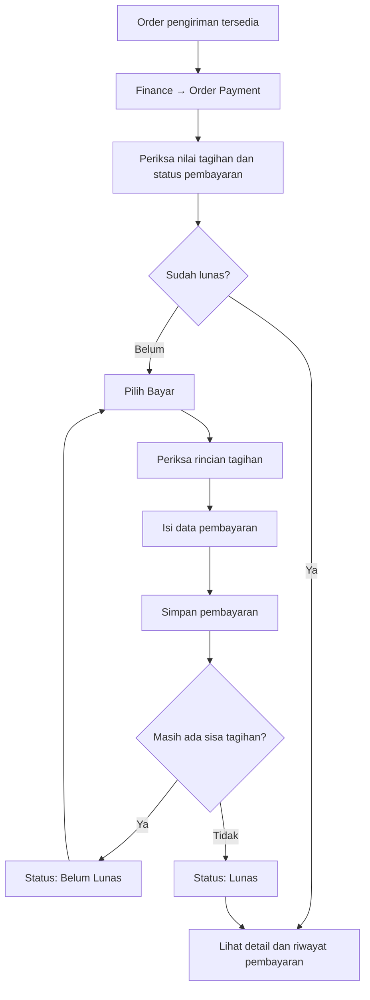
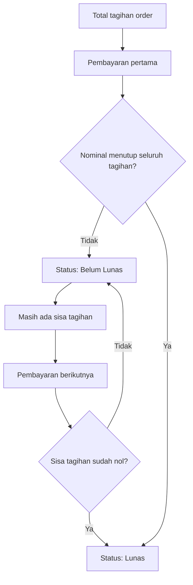
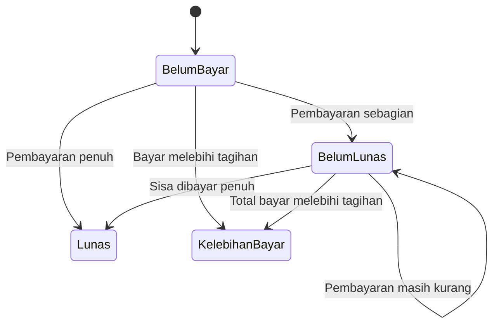
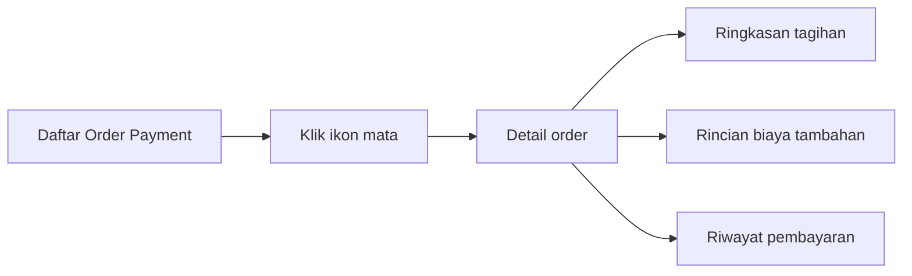

# Finance — Order Payment

**Menu:** Finance → Order Payment  
**URL:** `http://phl.test/finance/order-payment`

## Tujuan Menu

Menu **Order Payment** dipakai untuk mencatat pembayaran customer atas **satu order pengiriman**.

Pembayaran dapat dilakukan sebagai:

- **DP / cicilan**: pembayaran sebagian;
- **pelunasan**: pembayaran seluruh sisa tagihan.

Setiap baris pada daftar mewakili satu order. Riwayat pembayaran tiap order dapat dilihat kembali setelah pembayaran pertama dicatat.

---

## Alur Utama



---

## Informasi pada Daftar Order

Daftar membantu user mengecek order mana yang belum dibayar, masih memiliki sisa, atau telah lunas.

| Informasi | Kegunaan |
|---|---|
| No. Order | Identitas order pengiriman. |
| Tanggal Order | Tanggal order dibuat. |
| Nopol dan Driver | Informasi kendaraan serta pengemudi. |
| No. Surat Jalan | Referensi dokumen pengiriman. |
| Customer | Pihak yang melakukan pembayaran. |
| Asal dan Tujuan | Rute pengiriman. |
| Harga | Nilai dasar pengiriman. |
| Biaya Tambahan | Biaya `On Charge`, bila ada. |
| PPN / PPH | Nilai pajak yang memengaruhi tagihan. |
| Total Harga | Nilai akhir tagihan customer. |
| Jumlah Pembayaran | Total yang sudah diterima. |
| Sisa Pembayaran | Nilai yang masih harus dibayar. |
| Status | Belum Bayar, Belum Lunas, Lunas, atau Kelebihan Bayar. |

---

## Cara Mencatat Pembayaran

1. Buka **Finance → Order Payment**.
2. Cari order customer yang akan dibayar.
3. Klik ikon **kartu pembayaran** pada kolom **Aksi**.
4. Periksa ringkasan tagihan pada form:
   - harga rute;
   - biaya tambahan;
   - PPN;
   - PPH;
   - total tagihan;
   - total yang sudah dibayar;
   - sisa tagihan.
5. Jika tersedia, tentukan apakah **PPN** dan/atau **PPH** digunakan.
6. Pilih **bank tujuan transfer**.
7. Isi **tanggal pembayaran**.
8. Isi **nominal pembayaran**:
   - gunakan tombol **Bayar Lunas** untuk mengisi seluruh sisa tagihan;
   - isi nominal lebih kecil bila customer membayar DP/cicilan.
9. Isi keterangan bila diperlukan.
10. Klik **Simpan**.
11. Sistem memperbarui nominal terbayar, sisa tagihan, dan status order.

---

## Alur Pembayaran Bertahap



### Contoh

| Tahap | Pembayaran | Total Dibayar | Sisa | Status |
|---|---:|---:|---:|---|
| Tagihan awal | - | Rp0 | Rp11.445.000 | Belum Bayar |
| Pembayaran pertama | Rp3.000.000 | Rp3.000.000 | Rp8.445.000 | Belum Lunas |
| Pelunasan | Rp8.445.000 | Rp11.445.000 | Rp0 | Lunas |

---

## Komponen Tagihan

| Komponen | Arti |
|---|---|
| Harga Rute | Harga dasar pengiriman sesuai order. |
| Biaya Tambahan | Biaya tambahan pengiriman, bila ada. |
| Subtotal | Harga rute ditambah biaya tambahan. |
| PPN | Pajak yang menambah nilai tagihan. |
| PPH | Pajak yang mengurangi nilai tagihan. |
| Total Tagihan | Nilai akhir yang harus dibayar customer. |
| Sudah Dibayar | Akumulasi semua pembayaran customer. |
| Sisa Tagihan | Total tagihan dikurangi jumlah yang sudah dibayar. |

Rumus sederhana:

```text
Total Tagihan = Harga Rute + Biaya Tambahan + PPN − PPH
Sisa Tagihan = Total Tagihan − Sudah Dibayar
```

---

## Status Pembayaran



| Status | Makna |
|---|---|
| **Belum Bayar** | Belum ada pembayaran yang dicatat. |
| **Belum Lunas** | Sudah ada pembayaran, tetapi masih ada sisa tagihan. |
| **Lunas** | Total pembayaran sama dengan total tagihan. |
| **Kelebihan Bayar** | Total pembayaran lebih besar dari total tagihan. |

---

## Melihat Detail Pembayaran

Setelah order memiliki pembayaran, klik ikon **mata** pada kolom **Aksi**.

Halaman detail menampilkan:

- informasi order, customer, kendaraan, driver, dan rute;
- rincian biaya tambahan bila ada;
- ringkasan total tagihan, total terbayar, serta sisa tagihan;
- riwayat setiap pembayaran: tanggal, jenis pembayaran, rekening bank, keterangan, dan nominal.



---

## Hal yang Perlu Diperhatikan

- Nominal pembayaran harus lebih besar dari Rp0.
- Pembayaran dapat dilakukan lebih dari satu kali sampai lunas.
- Tombol **Bayar Lunas** mengisi nominal sesuai sisa tagihan saat itu.
- Order yang sudah lunas tidak dapat menerima pembayaran baru dari daftar ini.
- Jika nominal total pembayaran melebihi tagihan, status menjadi **Kelebihan Bayar**.
- Tidak tersedia fitur pembatalan pembayaran pada menu ini.
