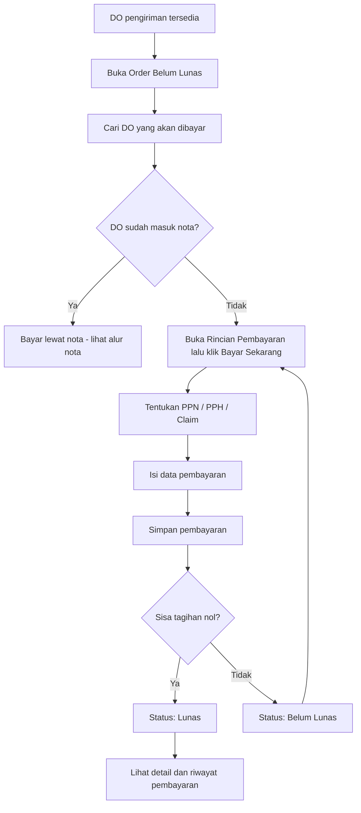
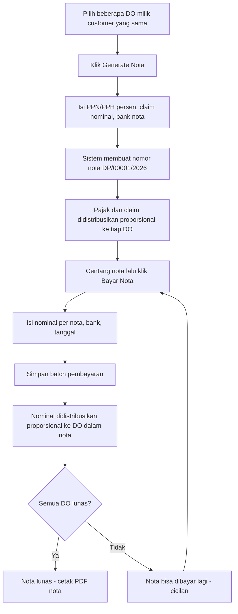
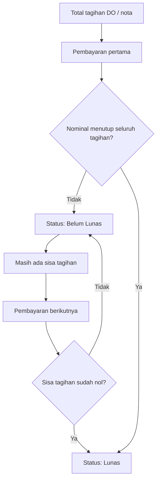
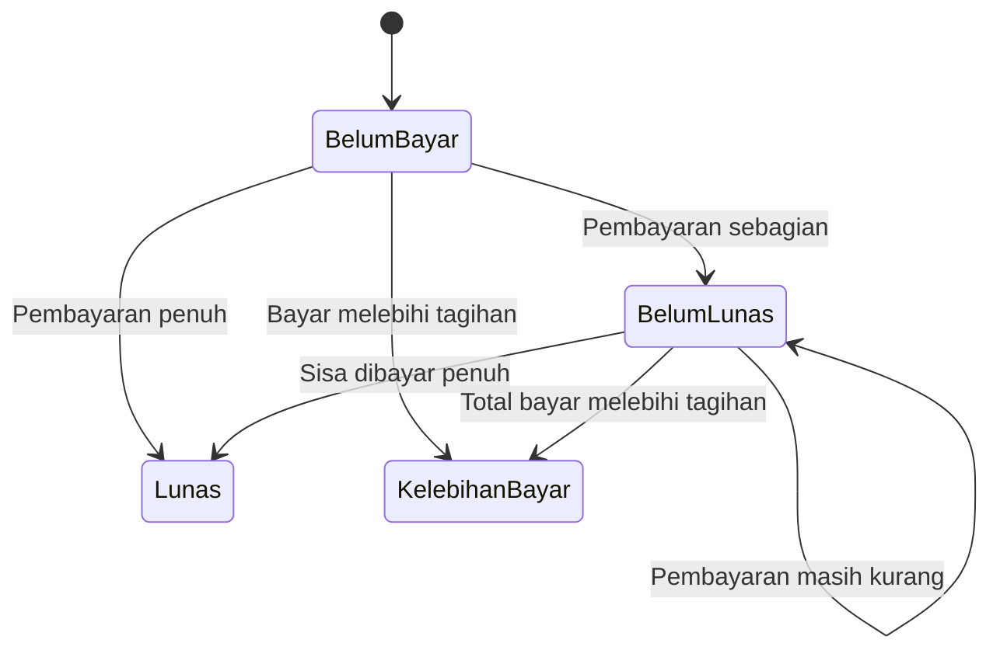
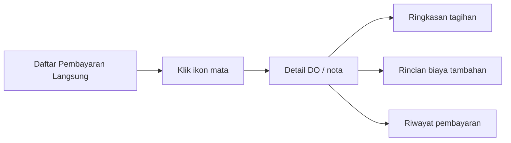

# Pembayaran Langsung (Direct Payment)

**Menu:** Pembayaran Langsung (menu utama) dengan 3 sub-menu  
**URL:** `http://phl.test/direct-payment`  
**Sebelumnya:** Finance → Order Payment (`finance/order-payment`, URL lama dialihkan otomatis)

## Struktur Menu

| Sub-menu | URL | Kegunaan |
|---|---|---|
| **Order Belum Lunas** | `direct-payment/order/unpaid` | Daftar DO yang belum lunas. Mencatat pembayaran tunggal, menggabungkan beberapa DO ke satu **nota**, membayar per nota, dan mencetak PDF. |
| **Order Lunas** | `direct-payment/order/paid` | Daftar DO yang sudah lunas. Melihat detail, mencetak PDF, dan membatalkan pembayaran nota (batch terakhir). |
| **Daftar Pembayaran** | `direct-payment/payment` | Riwayat semua transaksi pembayaran (tunggal maupun per nota), dapat dibuka untuk melihat rincian per transaksi. |

## Tujuan Menu

Menu **Pembayaran Langsung** dipakai untuk mencatat pembayaran customer atas order pengiriman (DO) secara langsung, tanpa melalui proses faktur. Tersedia dua mode pembayaran:

- **Pembayaran tunggal** — satu DO dibayar sendiri, boleh DP/cicilan beberapa kali sampai lunas;
- **Pembayaran nota (multi-DO)** — beberapa DO milik **customer yang sama** digabungkan ke satu nota terlebih dahulu, lalu dibayar per nota (DP/cicilan/lunas) — mengikuti pola pembayaran vendor.

Fitur utama:

- **PPN dan PPH** dapat diisi sebagai persentase maupun nominal;
- **Biaya Claim** dapat dicatat sebagai pengurang tagihan, disertai keterangan;
- pembayaran partial (DP/cicilan) dapat dilakukan beberapa kali sampai lunas, baik per DO maupun per nota;
- **riwayat pembayaran** tercatat lengkap untuk setiap transaksi, termasuk snapshot pajak yang dipakai saat transaksi dibuat;
- **pembatalan** tersedia untuk nota (sebelum ada pembayaran) dan untuk batch pembayaran nota (berjenjang, mulai dari yang terakhir).

---

## Alur Utama

### Pembayaran Tunggal (satu DO)



### Pembayaran Nota (multi-DO)



---

## Order Belum Lunas

Daftar DO yang masih memiliki sisa tagihan. Baris daftar bisa berupa **DO biasa** maupun **nota** (grup beberapa DO milik satu customer), tergantung filter yang dipilih.

### Filter Daftar

| Filter | Isi daftar |
|---|---|
| **Semua** | Semua DO belum lunas digabung dengan daftar nota. |
| **Belum Bayar** / **Belum Lunas** | Hanya DO individual. |
| **Nota** | Hanya grup nota. |

### Informasi pada Daftar

| Informasi | Kegunaan |
|---|---|
| No. Order / No. Nota | Identitas DO, atau nomor nota untuk grup nota. |
| Tanggal Order | Tanggal order dibuat. |
| Nopol dan Driver | Informasi kendaraan serta pengemudi. |
| No. Surat Jalan | Referensi dokumen pengiriman. |
| Customer | Pihak yang melakukan pembayaran. |
| Asal dan Tujuan | Rute pengiriman. |
| Harga | Nilai dasar pengiriman. |
| Biaya Tambahan | Biaya `On Charge`, bila ada. |
| PPN / PPH | Nilai pajak yang memengaruhi tagihan, beserta persentasenya bila dihitung dari persen. |
| Claim | Potongan biaya claim pada tagihan (bila ada). |
| Total Harga | Nilai akhir tagihan customer. |
| Jumlah Pembayaran | Total yang sudah diterima. |
| Sisa Pembayaran | Nilai yang masih harus dibayar. |
| Status | Belum Bayar, Belum Lunas, Lunas, atau Kelebihan Bayar. |

### Mencatat Pembayaran Tunggal

1. Buka **Order Belum Lunas**, cari DO customer yang akan dibayar.
2. Klik ikon **mata (Rincian Pembayaran)** pada kolom **Aksi**, lalu klik tombol **Bayar Sekarang**.
3. Periksa ringkasan tagihan pada form: harga rute, biaya tambahan, PPN, PPH, claim, total tagihan, total yang sudah dibayar, dan sisa tagihan.
4. Jika dipakai, aktifkan **Gunakan PPN** dan/atau **Gunakan PPH**, lalu pilih mode input:
   - **Persen (%)** — pajak dihitung otomatis dari subtotal, contoh: PPN 11%;
   - **Nominal (Rp)** — pajak diisi langsung sebagai nilai rupiah.
   
   Nilai dapat dikonversi bolak-balik saat berpindah mode.
5. Jika ada potongan, aktifkan **Biaya Claim Pengurang (-)**, isi nominal claim dan keterangannya.
6. Pilih **bank tujuan transfer**.
7. Isi **tanggal pembayaran**.
8. Isi **nominal pembayaran**:
   - gunakan tombol **Bayar Lunas** untuk mengisi seluruh sisa tagihan;
   - isi nominal lebih kecil bila customer membayar DP/cicilan (partial).
9. Isi keterangan bila perlu.
10. Klik **Simpan**.
11. Sistem memperbarui nominal terbayar, sisa tagihan, status DO, dan mencatat riwayat pembayaran.

> **Catatan:** DO yang sudah tergabung dalam nota **tidak bisa** dibayar tunggal. Sistem menolak dan menunjukkan nomor nota yang harus dipakai.

### Menggabungkan Beberapa DO ke Satu Nota

Nota memungkinkan beberapa DO milik satu customer ditagih dan dibayar dalam satu kesatuan, seperti pembayaran vendor.

**Syarat DO yang boleh digabung:**

- semua DO milik **customer yang sama**;
- hanya DO berstatus **Belum Bayar** — belum punya pembayaran sama sekali. DO yang sudah pernah dibayar (Belum Lunas) tidak boleh digabung dan harus diselesaikan sendiri (checkbox-nya dinonaktifkan).

**Langkah-langkah:**

1. Centang DO yang ingin digabung (minimal satu).
2. Klik **Generate Nota**.
3. Periksa ringkasan: jumlah DO, nama customer, dan subtotal gabungan.
4. Isi **PPN (%)** dan **PPh (%)** — dihitung otomatis dari total DPP seluruh DO terpilih (harga rute + biaya tambahan).
5. Isi **Biaya Claim** sebagai nominal beserta keterangan (opsional).
6. Pilih **bank nota** — dipakai sebagai referensi rekening pada PDF nota.
7. Klik **Simpan**. Sistem membuat nomor nota berformat `DP/00001/2026` (urut per tahun, tidak dipakai ulang).
8. Pajak dan claim **didistribusikan proporsional** ke setiap DO berdasarkan DPP masing-masing, dengan pembulatan yang selalu tepat jumlah.

**Contoh distribusi proporsional** (2 DO, PPN 11%, claim Rp50.000):

| DO | DPP | Porsi | PPN 11% | Claim |
|---|---:|---:|---:|---:|
| DO-A | Rp10.800.000 | 47,4% | Rp1.188.000 | Rp23.684 |
| DO-B | Rp12.000.000 | 52,6% | Rp1.320.000 | Rp26.316 |
| **Nota** | **Rp22.800.000** | 100% | **Rp2.508.000** | **Rp50.000** |

### Membayar Nota

1. Centang satu atau beberapa nota pada daftar.
2. Klik **Bayar Nota**.
3. Untuk tiap nota, isi nominal pembayaran — bisa DP, cicilan, atau **Bayar Lunas** per nota.
4. Pilih **bank tujuan transfer** dan **tanggal pembayaran** (satu untuk seluruh nota terpilih).
5. Isi keterangan bila perlu.
6. Klik **Simpan**. Satu transaksi batch dicatat (satu kode batch `DPB/...`), lalu:
   - nominal tiap nota didistribusikan proporsional ke DO di dalamnya berdasarkan sisa tagihan masing-masing;
   - saldo bank bertambah dan mutasi tercatat;
   - tiap DO mendapat riwayat pembayaran dengan kode batch yang sama.
7. Nota yang masih ada sisinya dapat dibayar lagi (cicilan) sampai lunas.

### Mencetak PDF

- **Cetak PDF** — cetak DO/nota terpilih sekaligus (PDF multi);
- **PDF Nota** — dari detail nota, cetak nota beserta rincian semua DO di dalamnya.

---

## Alur Pajak (PPN / PPH) dan Claim


- Persentase default mengikuti **master customer** (kolom PPN/PPH pada data customer) saat DO belum pernah dibayar.
- Setelah pembayaran pertama, form mengikuti nilai pajak yang tersimpan pada tagihan DO.
- Nilai persentase yang dipakai ikut tersimpan sehingga tampil kembali pada pembayaran berikutnya dan tercatat pada riwayat.
- Pada nota, PPN/PPH diinput sebagai **persen dari total DPP seluruh DO** dalam nota, lalu didistribusikan proporsional; claim diinput sebagai **nominal**, juga didistribusikan proporsional.

---

## Komponen Tagihan

| Komponen | Arti |
|---|---|
| Harga Rute | Harga dasar pengiriman sesuai order. |
| Biaya Tambahan | Biaya tambahan pengiriman, bila ada. |
| Subtotal (DPP) | Harga rute ditambah biaya tambahan. |
| PPN | Pajak yang menambah nilai tagihan (persen atau nominal). |
| PPH | Pajak yang mengurangi nilai tagihan (persen atau nominal). |
| Claim | Potongan biaya claim, mengurangi nilai tagihan (nominal, disertai keterangan). |
| Total Tagihan | Nilai akhir yang harus dibayar customer. |
| Sudah Dibayar | Akumulasi semua pembayaran customer. |
| Sisa Tagihan | Total tagihan dikurangi jumlah yang sudah dibayar. |

Rumus sederhana:

```text
PPN (mode persen)  = Subtotal × Persen PPN / 100
PPH (mode persen)  = Subtotal × Persen PPH / 100
Total Tagihan      = Subtotal + PPN − PPH − Claim
Sisa Tagihan       = Total Tagihan − Sudah Dibayar
```

---

## Alur Pembayaran Bertahap



### Contoh

| Tahap | Pembayaran | Total Dibayar | Sisa | Status |
|---|---:|---:|---:|---|
| Tagihan awal | - | Rp0 | Rp11.445.000 | Belum Bayar |
| Pembayaran pertama | Rp3.000.000 | Rp3.000.000 | Rp8.445.000 | Belum Lunas |
| Pelunasan | Rp8.445.000 | Rp11.445.000 | Rp0 | Lunas |

Prinsip yang sama berlaku untuk nota: sisa tagihan nota adalah jumlah sisa seluruh DO di dalamnya, dan setiap pembayaran nota otomatis mengurangi sisa tiap DO secara proporsional.

---

## Status Pembayaran



Status yang sama dipakai untuk DO maupun nota: status nota adalah agregat seluruh DO di dalamnya. DO yang tergabung dalam nota tetap menampilkan status pembayarannya sendiri (umumnya **Belum Bayar** sebelum nota dibayar).

| Status | Makna |
|---|---|
| **Belum Bayar** | Belum ada pembayaran yang dicatat. |
| **Belum Lunas** | Sudah ada pembayaran, tetapi masih ada sisa tagihan. |
| **Lunas** | Total pembayaran sama dengan total tagihan. |
| **Kelebihan Bayar** | Total pembayaran lebih besar dari total tagihan. |

---

## Order Lunas

Daftar DO yang sudah lunas. Dari halaman ini dapat dilakukan:

- melihat detail DO dan riwayat pembayarannya;
- mencetak PDF DO/nota terpilih (sama seperti di Order Belum Lunas);
- **membatalkan pembayaran nota** (batch terakhir) — lihat bagian Pembatalan.

DO yang dibatalkan pembayarannya otomatis kembali muncul di **Order Belum Lunas** dengan status sesuai sisa pembayarannya.

---

## Daftar Pembayaran

Riwayat semua transaksi pembayaran dalam satu daftar, mencakup:

- **pembayaran tunggal** (transaksi lama maupun baru, satu DO per transaksi);
- **batch pembayaran nota** — satu baris per batch, bisa mencakup beberapa nota dan banyak DO sekaligus.

Setiap baris menampilkan tanggal, kode batch, nomor nota, customer, nominal, bank, dan keterangan. Klik ikon pada kolom **Aksi** untuk melihat **rincian transaksi**: daftar seluruh DO yang terlibat beserta nominal yang dialokasikan ke masing-masing DO.

---

## Pembatalan

Pembatalan tersedia dua jenis, dengan aturan berbeda:

### Membatalkan Nota

- Dilakukan dari detail nota (Order Belum Lunas).
- Hanya boleh jika nota **belum memiliki pembayaran sama sekali**.
- Semua DO pada nota dilepas — kembali bisa dibayar tunggal atau digabung ke nota lain.
- Nomor nota **tidak dipakai ulang** (urutan tetap maju).
- Nota yang sudah pernah dibayar harus batalkan dulu **batch pembayarannya**, baru nota bisa dibatalkan.

### Membatalkan Pembayaran Nota (Batch)

- Dilakukan dari **Daftar Pembayaran** atau **Order Lunas**.
- Hanya **batch terakhir** per nota yang bisa dibatalkan — berjenjang: setelah batch terakhir dibatalkan, batch sebelumnya menjadi "terakhir" dan baru bisa dibatalkan (sesuai pola vendor).
- Pembatalan mengembalikan seluruh nominal batch: alokasi per DO dihapus, status DO dihitung ulang dari riwayat yang tersisa, saldo bank dikembalikan, dan catatan mutasi batch dihapus.
- Bila satu batch mencakup beberapa nota, seluruh nota dalam batch itu ikut dibatalkan.
- Riwayat cicilan lain (batch lebih lama) tetap dipertahankan.
- Bila **seluruh** pembayaran sebuah nota telah dibatalkan, nota itu baru bisa dibatalkan — setelah itu DO-nya bebas digabung ulang ke nota lain atau dibayar tunggal.

> **Catatan:** pembayaran tunggal (non-nota) tidak memiliki fitur pembatalan.

---

## Melihat Detail dan Riwayat Pembayaran

Setelah DO memiliki pembayaran, klik ikon **mata** pada kolom **Aksi**.

Halaman detail menampilkan:

- informasi DO, customer, kendaraan, driver, dan rute;
- badge nomor nota bila DO tergabung dalam nota;
- rincian biaya tambahan bila ada;
- ringkasan total tagihan, total terbayar, serta sisa tagihan, termasuk persentase PPN/PPH dan claim yang dipakai;
- **riwayat setiap pembayaran**: tanggal, tipe pembayaran (DP/Full), kode batch (bila via nota), rekening bank, PPN/PPH yang dipakai saat transaksi, keterangan, dan nominal.

Untuk nota, tersedia modal **detail nota** yang menampilkan ringkasan nota (tagihan, terbayar, sisa, pajak, claim, customer, bank, jumlah DO) sekaligus daftar seluruh DO di dalamnya beserta riwayat pembayarannya.



---

## Hal yang Perlu Diperhatikan

- Nominal pembayaran harus lebih besar dari Rp0.
- Pembayaran dapat dilakukan lebih dari satu kali sampai lunas (partial/DP/cicilan), baik per DO maupun per nota.
- Tombol **Bayar Lunas** mengisi nominal sesuai sisa tagihan saat itu.
- DO yang sudah lunas tidak dapat menerima pembayaran baru dari daftar ini.
- Jika nominal total pembayaran melebihi tagihan, status menjadi **Kelebihan Bayar**.
- PPN/PPH mode persen dihitung dari subtotal (harga rute + biaya tambahan); pada nota dihitung dari total DPP seluruh DO dalam nota.
- Nota hanya boleh berisi DO milik satu customer dan hanya DO yang belum punya pembayaran sama sekali.
- DO yang sudah masuk nota harus dibayar melalui nota tersebut — tidak bisa dibayar tunggal.
- Nomor nota tidak dipakai ulang walaupun nota dibatalkan.

---

## Catatan Teknis (untuk developer)

- **Menu:** `DIRECT_PAYMENT` (parent, `parentCode = 0`, url `#`, icon feather `credit-card`) dengan 3 sub-menu:
  - `DIRECT_PAYMENT_UNPAID` → `direct-payment/order/unpaid` (icon `mdi-cash-remove`);
  - `DIRECT_PAYMENT_PAID` → `direct-payment/order/paid` (icon `mdi-cash-check`);
  - `DIRECT_PAYMENT_LIST` → `direct-payment/payment` (icon `mdi-credit-card-outline`).
  
  Migrasi memindahkan akses role dari menu lama `ORDER_PAYMENT` dan menghapus menu lama. URL lama `finance/order-payment` dialihkan lewat redirect di `routes/finance.php`.
- **Route:** `routes/direct-payment.php`:
  - halaman: `direct-payment.order.unpaid`, `direct-payment.order.paid`, `direct-payment.payment.index`; `direct-payment.index` (redirect ke unpaid) dan `direct-payment.show` (legacy, dipakai redirect `finance.php`);
  - proses: `direct-payment.order.payment-single.store` (tunggal), `direct-payment.order.payment.store` (batch/nota), `direct-payment.order.generate-nota`, `direct-payment.order.cancel-nota`, `direct-payment.order.payment.cancel` (DELETE);
  - datatable: `dt.direct-payment.unpaid`, `dt.direct-payment.paid`, `dt.direct-payment-payment-list`;
  - ajax: `ajax.direct-payment-detail`, `ajax.direct-payment-nota-detail`, `ajax.direct-payment-payment-detail`;
  - PDF: `direct-payment.pdf-multi` (POST), `direct-payment.pdf-nota` (GET per order dalam nota).
- **Controller:** `App\Http\Controllers\Finance\DirectPaymentController`.
- **Service:** `App\Services\Finance\DirectPaymentService` — mempertahankan metode legacy pembayaran tunggal, plus: `assignNota`, `cancelNota`, `storeBatch` (idempotent via `request_key` + hash payload), `cancelPayment`, `notaDetail`, `findNotaGroups`, `distributeProportionally`, dll.
- **View:** `resources/views/direct-payment/order/unpaid.blade.php`, `order/paid.blade.php`, `payment/index.blade.php`, `show.blade.php` (legacy detail), serta partials `partials/table-style`, `partials/nota-modal-style`, `partials/modals`, `partials/flash-swal`.
- **Tombol Input Pembayaran per baris dihapus** dari daftar Order Belum Lunas — pembayaran tunggal dibuka lewat modal detail (ikon mata) via tombol **Bayar Sekarang** (`#detail-btn-bayar-now`, tampil hanya saat belum lunas); guard order-dalam-nota tetap berlaku di `store`.
- **Tabel:**
  - `order_payment` — kolom `ppn_percent`/`pph_percent` (terisi saat pajak dihitung dari persen), `claim`/`claim_description`, `nota_number` (indeks, nomor nota), `user_bank_code` (bank nota untuk PDF), `batch_code`; **`total` = akumulasi dibayar** (bukan tagihan), `status = 1` berarti lunas;
  - `order_payment_history` — snapshot `ppn`, `pph`, `ppn_percent`, `pph_percent` per transaksi + `batch_code` (indeks) untuk transaksi nota; kolom nominal memakai **`total`** (vendor memakai `amount`);
  - `order_payment_batch` — header batch pembayaran nota (kode prefix **DPB**, status `active/cancelled`, `request_key` + `payload_hash` untuk idempotensi);
  - `order_payment_nota_sequence` — urutan nomor nota per prefix per tahun (prefix **DP**, reset tiap tahun).
- **Tagihan dihitung:** `cost + additional_cost + ppn − pph − claim`. Kolom `order.status` **tidak** disentuh oleh alur pembayaran ini.
- **Aturan nota (ketat):** hanya order tanpa pembayaran sama sekali (`total = 0`, `status = 0`, tanpa history) yang boleh digabung; satu nota = satu customer (`isDo = 0`); order dalam nota ditolak di endpoint pembayaran tunggal (guard `nota_number`).
- **Distribusi proporsional:** pajak/claim didistribusi berdasar DPP tiap DO; pembayaran nota didistribusi berdasar sisa tagihan tiap DO — memakai metode largest-remainder agar jumlah selalu pas.
- **Mutasi bank:** `LiveMutation` **debit +** saat pembayaran (saldo = debit − credit), debit − saat pembatalan (refund per bank); `mutation.type = 'In'`, `transactionTypeCode = 'FTT250306114178'`, prefix kode mutasi **FMT**. Prefix kode history **FOPH**, prefix kode `order_payment` **FOP**.
- **`ppn_percent`** hanya disimpan saat rate > 0, selain itu `null`. `order_payment.user_bank_code` (bank nota) tidak ditimpa oleh pembayaran batch — bank pembayaran tersimpan di history.
- **Payload batch** dikirim per `nota_number` saja (order mandiri tidak bisa dibayar batch). Satu batch boleh mencakup beberapa nota sekaligus.
- **Alur data pembayaran tunggal:** form mengirim `ppn_type`/`pph_type` (`percent`/`nominal`), `ppn_percent`/`pph_percent`, nominal pajak, `claim` + `claim_description`; server menghitung ulang nominal dari persentase saat mode persen agar konsisten.
- **Pembatalan batch:** seluruh history ber-`batch_code` dihapus (lintas nota bila batch multi-nota), `OrderPaymentBatch.status` → `cancelled`, catatan mutasi batch di-`forceDelete`, `LiveMutation.debit` dikurangi dan balance dihitung ulang, `order_payment.total`/`status` dihitung ulang dari history tersisa; `request_key` batch yang sudah dibatalkan tidak boleh dipakai ulang (409).
