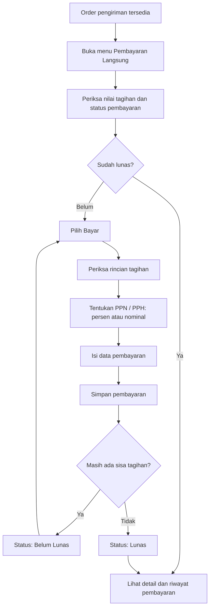
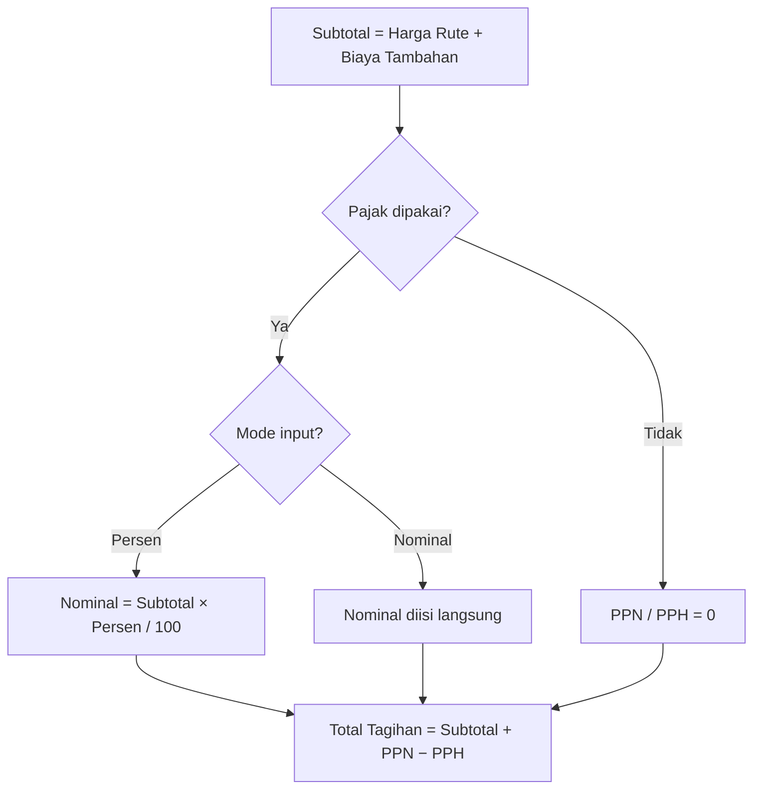
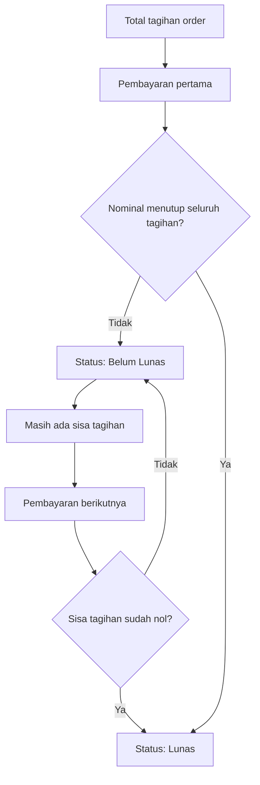
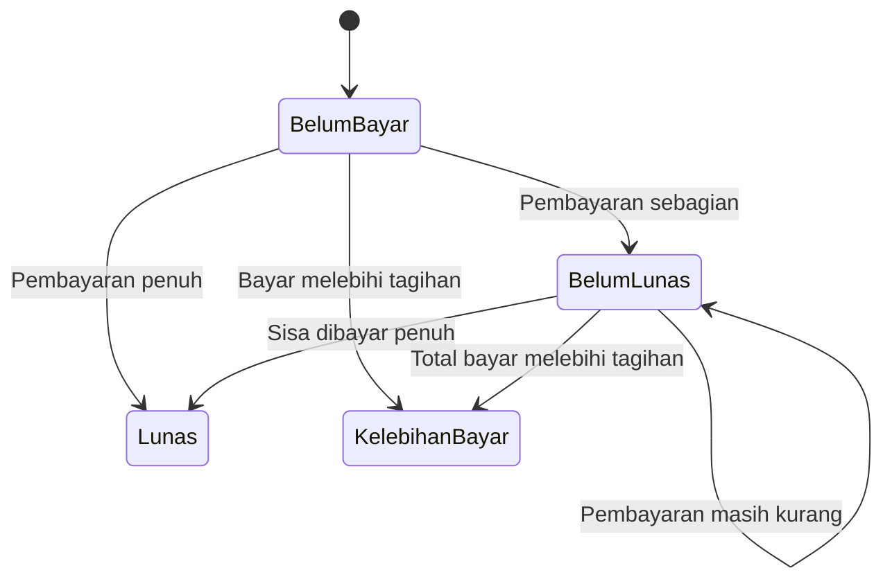
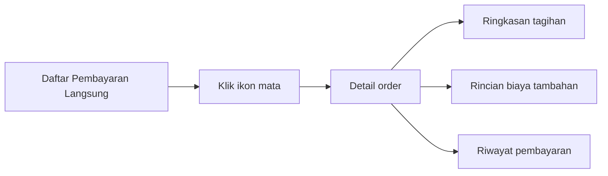

# Pembayaran Langsung (Direct Payment)

**Menu:** Pembayaran Langsung (menu tersendiri)  
**URL:** `http://phl.test/direct-payment`  
**Sebelumnya:** Finance → Order Payment (`finance/order-payment`, URL lama dialihkan otomatis)

## Tujuan Menu

Menu **Pembayaran Langsung** dipakai untuk mencatat pembayaran customer atas **satu order pengiriman** secara langsung, tanpa melalui proses faktur.

Pembayaran dapat dilakukan sebagai:

- **DP / cicilan (partial)**: pembayaran sebagian;
- **pelunasan**: pembayaran seluruh sisa tagihan.

Fitur utama:

- **PPN dan PPH dapat diisi sebagai persentase maupun nominal** — persentase dihitung otomatis dari subtotal (harga rute + biaya tambahan);
- **pembayaran partial** dapat dilakukan beberapa kali sampai lunas;
- **riwayat pembayaran** tercatat lengkap untuk setiap transaksi, termasuk snapshot PPN/PPH yang dipakai saat pembayaran dibuat.

Setiap baris pada daftar mewakili satu order. Riwayat pembayaran tiap order dapat dilihat kembali setelah pembayaran pertama dicatat.

---

## Alur Utama



---

## Informasi pada Daftar Order

Daftar membantu user mengecek order mana yang belum dibayar, masih memiliki sisa, atau telah lunas.

| Informasi | Kegunaan |
|---|---|
| No. Order | Identitas order pengiriman. |
| Tanggal Order | Tanggal order dibuat. |
| Nopol dan Driver | Informasi kendaraan serta pengemudi. |
| No. Surat Jalan | Referensi dokumen pengiriman. |
| Customer | Pihak yang melakukan pembayaran. |
| Asal dan Tujuan | Rute pengiriman. |
| Harga | Nilai dasar pengiriman. |
| Biaya Tambahan | Biaya `On Charge`, bila ada. |
| PPN / PPH | Nilai pajak yang memengaruhi tagihan, beserta persentasenya bila dihitung dari persen. |
| Total Harga | Nilai akhir tagihan customer. |
| Jumlah Pembayaran | Total yang sudah diterima. |
| Sisa Pembayaran | Nilai yang masih harus dibayar. |
| Status | Belum Bayar, Belum Lunas, Lunas, atau Kelebihan Bayar. |

---

## Cara Mencatat Pembayaran

1. Buka menu **Pembayaran Langsung**.
2. Cari order customer yang akan dibayar.
3. Klik ikon **kartu pembayaran** pada kolom **Aksi**.
4. Periksa ringkasan tagihan pada form:
   - harga rute;
   - biaya tambahan;
   - PPN;
   - PPH;
   - total tagihan;
   - total yang sudah dibayar;
   - sisa tagihan.
5. Jika dipakai, aktifkan **Gunakan PPN** dan/atau **Gunakan PPH**, lalu pilih mode input:
   - **Persen (%)** — pajak dihitung otomatis dari subtotal, contoh: PPN 11%;
   - **Nominal (Rp)** — pajak diisi langsung sebagai nilai rupiah.
   Nilai dapat dikonversi bolak-balik saat berpindah mode.
6. Pilih **bank tujuan transfer**.
7. Isi **tanggal pembayaran**.
8. Isi **nominal pembayaran**:
   - gunakan tombol **Bayar Lunas** untuk mengisi seluruh sisa tagihan;
   - isi nominal lebih kecil bila customer membayar DP/cicilan (partial).
9. Isi keterangan bila perlu.
10. Klik **Simpan**.
11. Sistem memperbarui nominal terbayar, sisa tagihan, status order, dan mencatat riwayat pembayaran.

---

## Alur Pajak (PPN / PPH)



- Persentase default mengikuti **master customer** (kolom PPN/PPH pada data customer) saat order belum pernah dibayar.
- Setelah pembayaran pertama, form mengikuti nilai pajak yang tersimpan pada tagihan order.
- Nilai persentase yang dipakai ikut tersimpan sehingga tampil kembali pada pembayaran berikutnya dan tercatat pada riwayat.

---

## Alur Pembayaran Bertahap



### Contoh

| Tahap | Pembayaran | Total Dibayar | Sisa | Status |
|---|---:|---:|---:|---|
| Tagihan awal | - | Rp0 | Rp11.445.000 | Belum Bayar |
| Pembayaran pertama | Rp3.000.000 | Rp3.000.000 | Rp8.445.000 | Belum Lunas |
| Pelunasan | Rp8.445.000 | Rp11.445.000 | Rp0 | Lunas |

---

## Komponen Tagihan

| Komponen | Arti |
|---|---|
| Harga Rute | Harga dasar pengiriman sesuai order. |
| Biaya Tambahan | Biaya tambahan pengiriman, bila ada. |
| Subtotal | Harga rute ditambah biaya tambahan. |
| PPN | Pajak yang menambah nilai tagihan (persen atau nominal). |
| PPH | Pajak yang mengurangi nilai tagihan (persen atau nominal). |
| Total Tagihan | Nilai akhir yang harus dibayar customer. |
| Sudah Dibayar | Akumulasi semua pembayaran customer. |
| Sisa Tagihan | Total tagihan dikurangi jumlah yang sudah dibayar. |

Rumus sederhana:

```text
PPN (mode persen)  = Subtotal × Persen PPN / 100
PPH (mode persen)  = Subtotal × Persen PPH / 100
Total Tagihan      = Subtotal + PPN − PPH
Sisa Tagihan       = Total Tagihan − Sudah Dibayar
```

---

## Status Pembayaran



| Status | Makna |
|---|---|
| **Belum Bayar** | Belum ada pembayaran yang dicatat. |
| **Belum Lunas** | Sudah ada pembayaran, tetapi masih ada sisa tagihan. |
| **Lunas** | Total pembayaran sama dengan total tagihan. |
| **Kelebihan Bayar** | Total pembayaran lebih besar dari total tagihan. |

---

## Melihat Detail dan Riwayat Pembayaran

Setelah order memiliki pembayaran, klik ikon **mata** pada kolom **Aksi**.

Halaman detail menampilkan:

- informasi order, customer, kendaraan, driver, dan rute;
- rincian biaya tambahan bila ada;
- ringkasan total tagihan, total terbayar, serta sisa tagihan, termasuk persentase PPN/PPH yang dipakai;
- **riwayat setiap pembayaran**: tanggal, tipe pembayaran (DP/Full), rekening bank, PPN/PPH yang dipakai saat transaksi, keterangan, dan nominal.



---

## Hal yang Perlu Diperhatikan

- Nominal pembayaran harus lebih besar dari Rp0.
- Pembayaran dapat dilakukan lebih dari satu kali sampai lunas (partial/DP/cicilan).
- Tombol **Bayar Lunas** mengisi nominal sesuai sisa tagihan saat itu.
- Order yang sudah lunas tidak dapat menerima pembayaran baru dari daftar ini.
- Jika nominal total pembayaran melebihi tagihan, status menjadi **Kelebihan Bayar**.
- PPN/PPH mode persen dihitung dari subtotal (harga rute + biaya tambahan).
- Tidak tersedia fitur pembatalan pembayaran pada menu ini.

---

## Catatan Teknis (untuk developer)

- **Menu:** `DIRECT_PAYMENT` (menu utama tersendiri, `parentCode = 0`, url `direct-payment`, icon feather `credit-card`). Migrasi memindahkan akses role dari menu lama `ORDER_PAYMENT` dan menghapus menu lama.
- **Route:** `routes/direct-payment.php` — resource `direct-payment`, datatable `dt.direct-payment`, ajax `ajax.direct-payment-detail`, PDF multi `direct-payment.pdf-multi`. URL lama `finance/order-payment` dialihkan lewat redirect di `routes/finance.php`.
- **Controller:** `App\Http\Controllers\Finance\DirectPaymentController`.
- **Service:** `App\Services\Finance\DirectPaymentService`.
- **View:** `resources/views/direct-payment/index.blade.php` dan `show.blade.php`.
- **Tabel:**
  - `order_payment` — tambah kolom `ppn_percent`, `pph_percent` (terisi saat pajak dihitung dari persen);
  - `order_payment_history` — tambah kolom snapshot `ppn`, `pph`, `ppn_percent`, `pph_percent` per transaksi.
- **Alur data pembayaran:** form mengirim `ppn_type`/`pph_type` (`percent`/`nominal`), `ppn_percent`/`pph_percent`, dan nominal pajak; server menghitung ulang nominal dari persentase saat mode persen agar konsisten.
